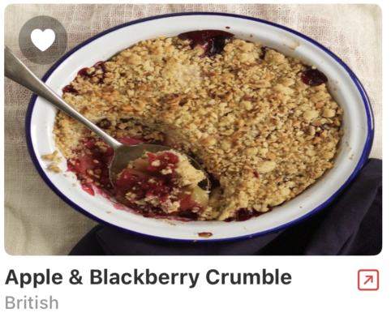
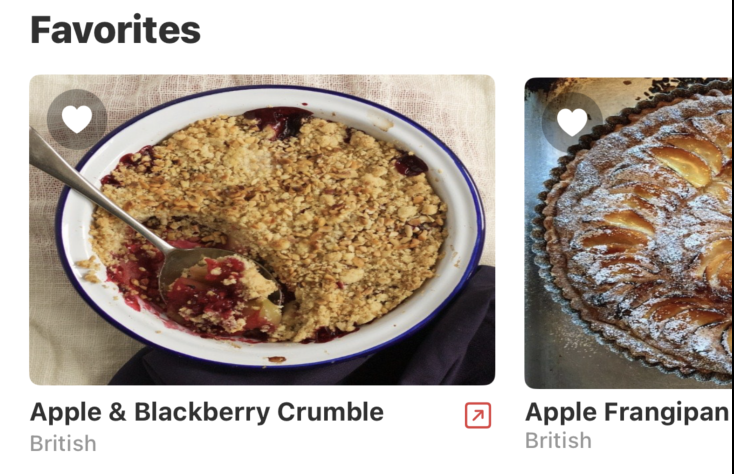
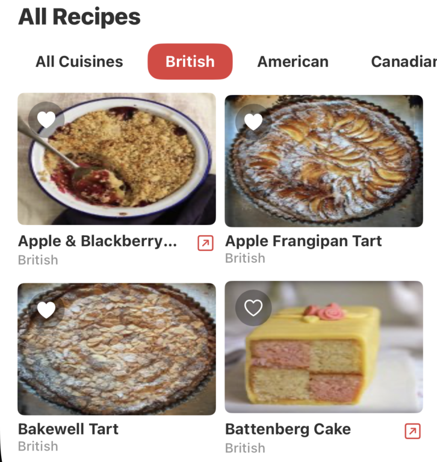
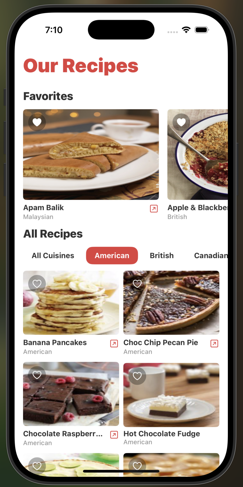

## Summary - Main Features

- **Recipe Cards**:  
  Each recipe card displays the recipe's name, cuisine, image, a button to visit the recipe source URL (if available), and a button to add the recipe to your favorites.
  
    

- **Favorites Section**:  
  This section shows all recipe cards that have been added to your favorites in a larger format for easy reference. If no recipes are favorited, a placeholder message is displayed.
  
  

- **All Recipes Section**:  
  All recipes parsed from the JSON endpoint are displayed as recipe cards. Users can easily filter these recipes.
  
  

- **Cuisine Filters**:  
  Users can filter recipes by a specific cuisine or choose to view all recipes.
  
  
  

## Focus Areas
- **User Interface & Experience**:  
  I prioritized building an intuitive, visually pleasing, and responsive UI using SwiftUI. The recipe cards, favorites section, and cuisine filters were designed to provide a seamless browsing and filtering experience.
  
- **Asynchronous Networking & Image Caching**:  
  Efficiently fetching data from the provided JSON endpoint and caching images to reduce network usage was critical to ensuring a smooth user experience even on slower networks.

- **State Management**:  
  Centralized state management using ObservableObjects was a key focus, enabling dynamic filtering, favoriting, and reactive UI updates.

## Time Spent
I spent approximately **4.5 hours** on this project, allocated as follows:
- **2 hours**: Implementing and testing the networking, JSON decoding, and image caching.
- **1.5 hours**: Designing and refining the UI with SwiftUI, including recipe cards and filtering features.
- **0.5 hours**: Setting up state management and integrating favoriting functionality.
- **0.5 hours**: Writing tests and documentation.

## Trade-offs and Decisions
- **SwiftUI vs. UIKit**:  
  I chose SwiftUI as it is the modern industry standard for iOS development, allowing for rapid development and clean, declarative code.
- **Image Caching**:  
  Instead of relying on URLSession’s built-in caching or third-party libraries, I implemented custom disk caching for images, which improved network efficiency and customization.
- **Favoriting Implementation**:  
  I centralized favoriting logic in a dedicated view model for better reactivity and consistency across the app.
- **Testing Framework**:  
  I opted to use XCTest for unit testing instead of adopting the new Swift testing DSL due to my familiarity with XCTest.

## Weakest Part of the Project
The unit testing is likely the weakest part of the project. This is an area in which I have less experience, and my tests could have been more exhaustive.

## Additional Information
- **Testing**:  
  I included unit tests for networking, JSON decoding, and image caching to ensure robustness.
- **Future Enhancements**:  
  Future improvements could include more robust error handling, displaying YouTube videos, enhanced image caching strategies, and additional UI polish based on user feedback.
